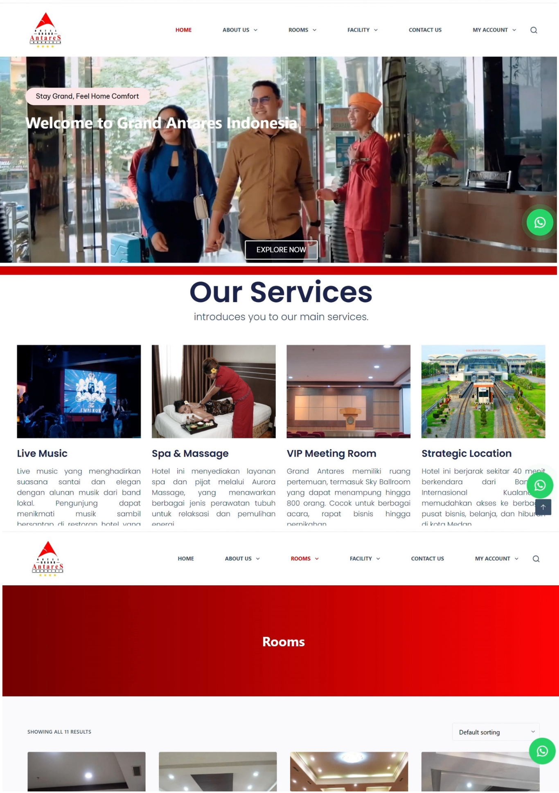
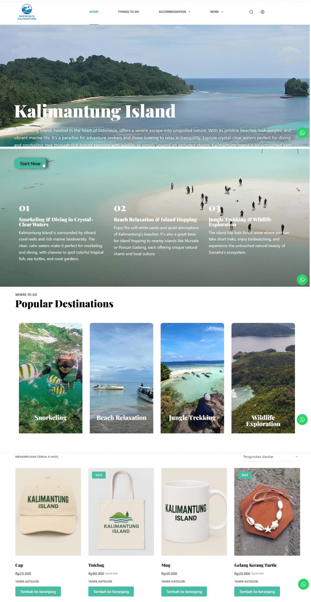
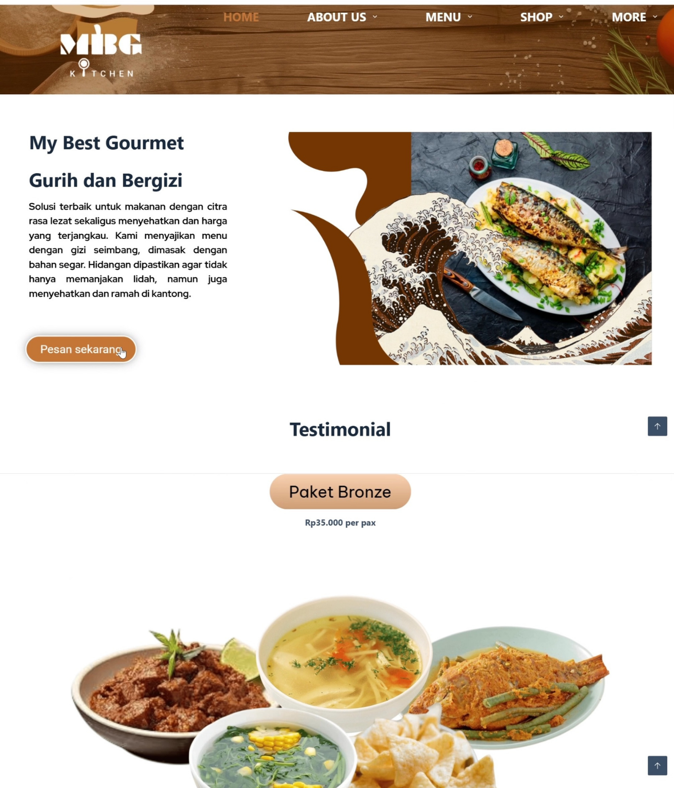

## Tools
 
### Service for business development
* Brand Identity
* UI/UX Design
* Digital Marketing (SEO)
* Website Development
* Project Management

## Projects

>[!NOTE]
>Customers must quickly find room types, pricing, and booking options. Poor structure leads to drop-offs. This project addresses that gap by translating personal branding into a cohesive digital experience. The visual direction builds perceived value through typography, spacing, and refined color palettes, positioning the brand as high-quality and customer-oriented.

>[!NOTE]
> Kalimantung island storytelling must guide users from curiosity to travel intent. This project uses CMS platforms or frameworks such as WordPress allow efficient content management. CSS frameworks or responsive design techniques ensure compatibility across devices as well as updated travel information and packages.

>[!NOTE]
>The catering website has flexible menus and order details. Content editing tools ensure readability, consistency, alignment with user intent. For catering, menus, pricing, and ordering must be frictionless to convert interest into orders.

